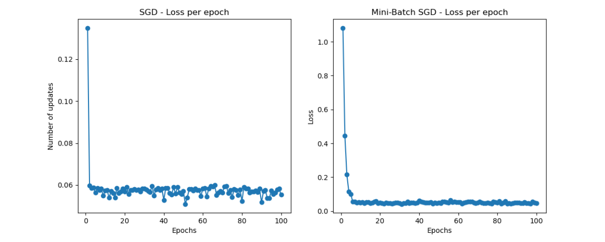

# Project Report: Studies of Perceptron Learning and Adaline

**Dmitri Azih** and **Dylan Rivas**

# Purposes

- Understanding perceptron learning and Adaline algorithms.
- Investigating the performance difference of the two algorithms.
- Understanding the linear classification problem.
- Understanding mini-batch Stochastic Gradient Descent (SGD).

# Implementation Tasks

1. Compare the loss, updates, margin, and convergence of perceptron learning and Adaline using the Iris dataset (first 2 classes), ensuring the same initial parameters, data, learning rate, and epochs, and provide at least 3 mathematical conclusions.
2. Modify the Perceptron class to absorb the bias term into the weight vector `w` while ensuring compatibility with the textbook's training program.
3. Use multiple perceptrons for multiclass classification of the Iris dataset (all features), by adapting the Perceptron class developed in Task 2 to handle this task.
4. Implement a `fit_mini_batch_SGD` function in the AdalineSGD class, combining SGD and mini-batch GD to update learning parameters based on a randomly selected subset of the training data in each epoch.

## 1. Comprehensive Comparison: Perceptron & Adaline

For Task 1, we provide a comprehensive analysis comparing the performance of the Perceptron and Adaline algorithms on their performance factors. From this, we’ll draw meaningful mathematically supported conclusions regarding the behavior of these two learning models. We’ll draw three conclusions based on the following model performance factors: convergence speed, number of updates, and margin of separation (hyperplane).

### 1.1 Convergence Speed

**Conclusion**: Adaline seems to converge more smoothly than the Perceptron. In other perceptron implementations, the convergence tends to oscillate due to its binary updates (1 or 0), whereas the Adaline uses a continuous error term and is able to adjust weights more smoothly. However, in our current implementation, the Perceptron seems to almost converge immediately around the 2nd epoch, stabilizing at 35 misclassifications, most likely because the data is very linearly classifiable.

**Mathematical Explanation**: The Perceptron algorithm updates its weights as follows:
`w ← w + η(y − ŷ)x`.
Because the error is a step function, the updates can be erratic before final convergence. The Adaline algorithm updates weights by taking the partial derivative of the loss function:
`w ← w - η(∂L)/(∂w)`,
where the loss function is:
`L(w) = (½) * ∑i=1 to N (yi − ŷi)^2`.
Since this update uses gradient descent, weight adjustments are smoother as the magnitude of error is accounted for compared to only binary updates.

### 1.2 Number of Updates (Misclassifications)

**Conclusion**: The Perceptron tends to need more updates than Adaline to finally reach an optimal separation boundary.

**Mathematical Explanation**: Since the Perceptron only updates when a misclassification happens, the number of updates is tied with the number of misclassifications during training. If the data is linearly separable, convergence is guaranteed by the Perceptron Convergence Theorem. However, because it's dependent on the separation between data points and the decision boundary, the Perceptron will update its weights even for small, almost unnecessary misclassifications. This causes a lot of updates to occur before final convergence.
In contrast, the Adaline minimizes its mean squared error loss function over all training set samples, meaning its updates are less frequent. Moreover, Adaline’s continuous gradient of loss update results in fewer updates overall, simply focusing on the magnitude of error rather than correcting misclassifications.

### 1.3 Margin of Separation (Hyperplane)

**Conclusion**: The Perceptron does not optimize the margin; it only ensures linear separability. While the Adaline doesn’t optimize the margin either, it tends to lead to a more refined separation than the Perceptron.

**Mathematical Explanation**: The two models were tested for their margin of separation, producing the following results:
- Perceptron margin: 0.0076
- Adaline margin: 1.7842

These results align with our conclusion and can be explained through the models' update rules. The Perceptron updates as follows:
`w ← w + η(y − ŷ)x`.
Meaning weights are only updated when a misclassification occurs, and the Perceptron does not optimize the margin. Therefore, the moment it finds a separating hyperplane, it stops updating, even if the margin is small.
Adaline updates similarly to the Perceptron:
`w ← w + η(y − ŷ)x`,
but also optimizes its weights by minimizing the loss function of mean squared error:
`L(w) = (½) * ∑i=1 to N (yi − ŷi)^2`.
By Adaline reducing weight magnitudes by minimizing the loss function, it indirectly maximizes the margin (`margin = γ = 1/∥w∥`), leading to the larger margin we observed.

## 2. Absorbing Bias

For Task 2, we create a Perceptron model in which the bias is absorbed into the weight vector. Two models are shown, both trained on the same data from the Iris dataset. These models end up being equivalent, as they are mathematically identical. The bias is transformed into an extra weight by first appending a 1 to the feature vector. We then add the bias to the end of the weight vector as an extra weight. Now, when the weights are multiplied by the features in the Perceptron equation, the bias is simply multiplied by 1, effectively integrating it into the weight vector. This model is equivalent to the original Perceptron because the resulting equations are the same. The prediction equation for a Perceptron model is:
`z = wTx + b`.
The dot product `wTx` expands to `w1x1 + w2x2 + ... + wnxn`, and then `b` is added. When the bias is absorbed into the weights as described, the equation becomes:
`w1x1 + w2x2 + ... + wnxn + b * 1`,
which is equivalent to the original equation `z = wTx + b`.

## 3. Multiclass Classification Method

For Task 3, we used the Perceptron model with the absorbed bias to perform Multiclass Classification. We developed a model that trains one Perceptron for each class. Each Perceptron classifies one of the three classes against the rest. The model computes the net input for each Perceptron and selects the class with the highest value, meaning the most likely class. This method is valid, as the model learns from the data to classify based on likelihood. Perceptrons work well for linearly separable data, ensuring correct classification in those cases. However, the model has limitations, as its accuracy is not 100%. I was unable to achieve more than 66.7% accuracy because not all of the data is linearly separable. In particular, Versicolor and Virginica are not linearly separable, making it difficult for a Perceptron to classify them correctly, regardless of the number of Perceptrons used.

## 4. Comprehensive Comparison: Mini-Batch SGD & SGD

For Task 4, we compared the performance of mini-batch SGD to SGD and GD based on the same initial parameter values, training data, learning rate, and number of epochs. After calculating misclassifications and plotting losses, we can see a clear outperformer: mini-batch SGD.

  **Figure 1. Loss per epoch plot of SGD and mini-batch SGD**

We can see the loss for mini-batch SGD decreases quickly within a few epochs and stabilizes around 20 epochs. SGD’s loss also decreases quickly but is subject to more fluctuations and doesn’t converge as smoothly. SGD’s noise makes sense when we consider that its update rule updates after every sample, making it more sensitive. It seems like mini-batch SGD’s batches of data lead to a more stable loss curve.
When tested for misclassifications post-training, mini-batch SGD had 22 misclassified samples out of 45, while SGD had 27. Although the number of misclassifications seems high compared to the Perceptron and Adaline’s performance, this is truly due to the learning rate not being optimized for each model. Lastly, mini-batch SGD converged at a lower loss value than SGD (as seen in figure 1), making it by far the most superior model we have tested.

## 5. Contributions

The following individuals contributed to solving the assigned problems:

- **Dmitri Azih**: Responsible for Task 1 and Task 4.
- **Dylan Rivas**: Responsible for Task 2 and Task 3.
